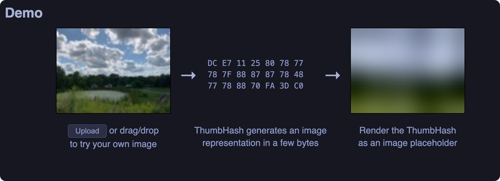

# Bitiful_toolkit

## Intro

> [!INFO]
>
> A very compact representation of an image placeholder. Store it inline with your data and show it while the real image is loading for a smoother loading experience. It's similar to BlurHash but with the following advantages:
>
> - Encodes more detail in the same space
> - Also encodes the aspect ratio
> - Gives more accurate colors
> - Supports images with alpha
> - Despite doing all of these additional things, the code for ThumbHash is still similar in complexity to the code for BlurHash. One potential drawback compared to BlurHash is that the parameters of the algorithm are not configurable (everything is automatically configured).
>
> The code for this is available at https://github.com/evanw/thumbhash and contains implementations for JavaScript, Rust, Swift, and Java. You can use npm install thumbhash to install the JavaScript package and cargo add thumbhash to install the Rust package.
>
> 

progressive_image 会请求 bitiful server，拿到 thumbhash base64 text，多次运行可能会浪费请求次数，bitiful 计费参考[计费概述 - 缤纷云文档](https://docs.bitiful.com/prices/basic#%E5%85%8D%E8%B4%B9%E9%A2%9D%E5%BA%A6)
因此本地测试环境设置不启用；如需开启，设置`$env.CI = true`，CI/CD Pipeline 同理；

```js
if (
  !hexo.config.bitiful_toolkit ||
  !hexo.config.bitiful_toolkit.enable ||
  process.env.CI !== "true"
) {
  //
  log.info("[bitiful_toolkit] Skip Image Processing...");
  return;
}
```

本次测试时，可以直接运行`bun run test`，在浏览器打开`/test/output/index.html`查看效果。效果如图所示

<video controls src="assets/README/README.mov" title="Title"></video>

## Setup

`$bun add git+https://github.com/Efterklang/Bitiful_Responsive_And_Progressive_Image`

```yaml
bitiful_toolkit:
  enable: true
  all: false
  srcset_widths: [200, 400, 600, 800, 1200, 2000, 3000]
  add_max_width: false
  max_widths: "(max-width: 600px) 100vw, (max-width: 1200px) 50vw, 800px"
  enable_lazy_loading: true
  lazy_skip_first: 2
  supported_domains: ["assets.vluv.space", "s3.bitiful.net", "bitiful.com"]
  exclude_formats: ['svg', 'gif'],
  inject_css: true
```

## Ref

- [ThumbHash: A very compact representation of an image placeholder](https://evanw.github.io/thumbhash/)
- [图像 BlurHash 与 ThumbHash 哈希占位技术： - 缤纷云文档](https://docs.bitiful.com/bitiful-s4/features/hash-placeholder)
